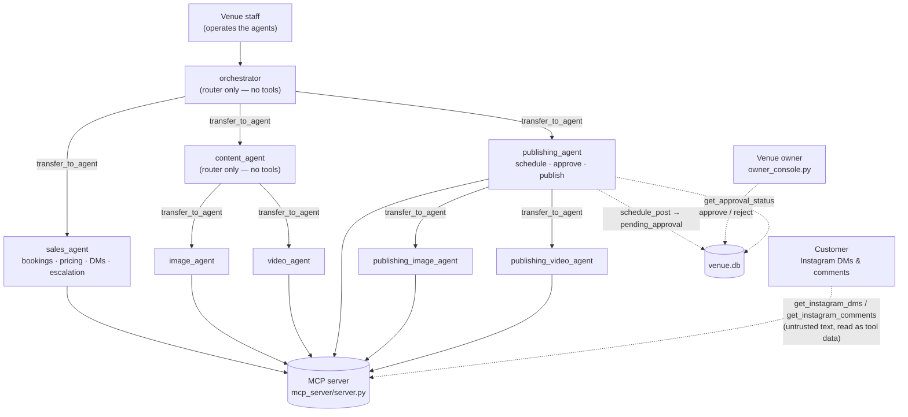

# Innoviz Crown Business Agent

A multi-agent system that automates marketing content creation and customer
engagement for **Innoviz Crown**, a real VR entertainment venue in Australia
(Instagram [@thrillmates](https://instagram.com/thrillmates)). It drafts
replies to customer DMs and comments for human review, checks availability
and creates bookings against the venue database, generates on-brand images
and video scripts, and schedules social posts — with every publish gated
behind explicit owner approval. Outbound sends are simulated by default:
DM replies and TikTok posts always are, and Instagram publishing only goes
live once `IG_USER_ID`/`IG_ACCESS_TOKEN` are configured. It was built by a
member of the venue's own staff to automate marketing and front-desk work
they currently do by hand.

## Architecture



The agents don't have a live chat surface facing the public — a venue
staff member is the one talking to `orchestrator` (via `adk web` or the
demo scripts). Customer DMs and comments enter the system the other way:
as rows in `venue.db` that `sales_agent` reads through
`get_instagram_dms`/`get_instagram_comments`, wrapped as untrusted tool
data (see [Security](#security)), not as messages typed into the
conversation.

Every box above is a Google ADK `LlmAgent`. Sub-agents are wired via ADK's
`sub_agents=[...]` and can only be reached through the `transfer_to_agent`
tool — an agent can never call another agent directly, only hand control
to it.

**Why the split is shaped this way:**

- **`orchestrator`** has no tools of its own and holds no business
  knowledge — it exists purely to classify a request (sales vs. content
  vs. publishing) and route it. That's deliberate: since it can't call any
  MCP tool, it structurally cannot invent a price, a booking, or a post.
- **`sales_agent`** is the only agent that touches untrusted external
  input (Instagram DMs and comments), so it's isolated with its own
  tool set that includes the security tools (`detect_prompt_injection`,
  `flag_for_owner_review`) and its own `after_agent_callback` guard
  (see [Security](#security)).
- **`content_agent`** is a second thin router (also no tools), splitting
  by media type into `image_agent` / `video_agent`. Standalone content
  requests never touch booking or publishing tools.
- **`image_agent` / `video_agent`** are built by one factory function
  (`create_image_agent`, `create_video_agent` in
  `agents/content_agent/agent.py`) and reused twice: once under
  `content_agent` for standalone assets, and once under `publishing_agent`
  (with a `publishing_` name prefix) when an image or script is needed as
  part of a scheduling workflow — see [lesson #3](#engineering-lessons-learned)
  for why the prefix exists.
- **`publishing_agent`** owns the entire schedule → request-approval →
  publish pipeline and is the only agent allowed to call
  `publish_instagram_post` / `publish_tiktok_post` — and even it is
  instructed never to call them without a confirmed `get_approval_status`
  result.

## Try it without API keys

All five demo scenarios have pre-generated transcripts checked into
[`docs/transcripts/`](docs/transcripts/), showing the complete trace for a
real run — every tool call and its arguments, every agent transfer, and
every claim-guard correction. That's enough to read and evaluate the
system's actual behavior (routing, tool use, the approval gate, the
prompt-injection defense) without installing anything or configuring
`GOOGLE_API_KEY`/`HF_TOKEN`. Start with
[`docs/transcripts/security_prompt_injection.md`](docs/transcripts/security_prompt_injection.md) —
it shows the injection scan, the deterministic auto-flag, and the
claim-verification guard rewriting an unverified claim, all in one trace.

## MCP tool layer

All business logic lives in one MCP server (`mcp_server/server.py`, stdio
transport, 24 tools) that every agent connects to independently — ADK
creates a fresh `McpToolset` (and stdio subprocess) per agent, and each
agent gets a `tool_filter` naming only the tools it's allowed to call.
This is **per-agent least-privilege at the tool layer**, not just an
instruction: `sales_agent` cannot physically call `publish_instagram_post`
because it isn't in its filter, regardless of what its prompt says.

| Tool | Domain | What it does | Agents with access |
|---|---|---|---|
| `get_attractions` | Business/booking | List all attractions with nested pricing | sales_agent, image_agent, video_agent, publishing_agent |
| `get_pricing` | Business/booking | Pricing lookup, optionally filtered by attraction | sales_agent |
| `check_availability` | Business/booking | Check a proposed time slot against hours + existing bookings | sales_agent |
| `create_booking` | Business/booking | Create a `pending` booking; price always read from DB, never invented | sales_agent |
| `get_upcoming_bookings` | Business/booking | List non-cancelled bookings in a date window | sales_agent |
| `log_customer_interaction` | Business/booking | Record a CRM touchpoint (DM, comment, or walk-in) | sales_agent |
| `get_brand_guidelines` | Content | Read-only brand voice/visual-style reference | image_agent, video_agent, publishing_agent |
| `generate_image` | Content | FLUX.1-schnell image generation (brand style auto-prepended), Pillow fallback on failure | image_agent |
| `generate_video_script` | Content | Deterministic script/shot-list/caption scaffold, no external API | video_agent |
| `moderate_content` | Content | Read-only rule-based caption/text check (profanity, all-caps, missing tag, price accuracy, length) | image_agent, video_agent, publishing_agent — also invoked *internally* (not agent-visible) by `schedule_post` and `reply_instagram_dm` |
| `get_optimal_posting_time` | Publishing | Read-only heuristic posting-time windows | publishing_agent |
| `schedule_post` | Publishing | Validate image + moderate caption + insert as `pending_approval` (never publishes directly) | publishing_agent |
| `get_scheduled_posts` | Publishing | Read-only list of scheduled posts, optionally by status | publishing_agent |
| `cancel_scheduled_post` | Publishing | Cancel a post still in `pending_approval`/`approved` | publishing_agent |
| `publish_instagram_post` | Publishing | **The gate.** Refuses unless status is exactly `approved`; real Graph API call if `IG_USER_ID`/`IG_ACCESS_TOKEN` set, else simulated | publishing_agent |
| `publish_tiktok_post` | Publishing | **The gate.** Same approval check; always simulated (no public TikTok posting API) | publishing_agent |
| `detect_prompt_injection` | Security | Read-only rule-based injection scan, standalone callable | sales_agent — also run automatically inside the messaging tools below |
| `get_instagram_dms` | Messaging | Read inbound DMs; wraps text in `<untrusted_user_content>`, attaches `injection_scan`, auto-flags medium/high severity | sales_agent |
| `reply_instagram_dm` | Messaging | Reply to a DM thread; moderated internally before sending; real Graph API send is a stub (see [Limitations](#known-limitations)) | sales_agent |
| `get_instagram_comments` | Messaging | Read IG comments; same scan/wrap/auto-flag treatment as DMs | sales_agent |
| `get_tiktok_comments` | Messaging | Read TikTok comments; same scan/wrap/auto-flag treatment as DMs | sales_agent |
| `flag_for_owner_review` | Approval | Agent-invoked escalation (refunds, injuries, legal, anything unsure) → `owner_flag` CRM row | sales_agent |
| `request_approval` | Approval | Create a `pending` approval row for a `pending_approval` post — agent may only *request*, never grant | publishing_agent |
| `get_approval_status` | Approval | Read (and cascade) an owner decision back onto the linked post | publishing_agent |

## Human-in-the-loop approval

Every social post follows the same state machine before anything goes
live:

```
publishing_agent proposes
   → moderate_content (rule-based check)
   → schedule_post inserts status='pending_approval'
   → request_approval creates an approvals row (status='pending')
   → owner reviews via owner_console.py:  `list` / `approve <id>` / `reject <id> <reason>`
   → get_approval_status cascades the decision onto scheduled_posts.status
   → only once status == 'approved' can publish_instagram_post / publish_tiktok_post succeed
```

This is enforced at **two independent layers**, not just one:

- **Instruction layer** — `publishing_agent`'s prompt states it must
  "NEVER call `publish_instagram_post` or `publish_tiktok_post` unless
  `get_approval_status` confirms the post is approved."
- **Tool layer** — `publish_instagram_post` and `publish_tiktok_post`
  independently check `row["status"] != "approved"` and return an error
  before doing anything else, regardless of what the agent believes.
  Even if the model ignored its instructions, the tool itself refuses.

`owner_console.py` is a small standalone CLI (no agent involved) that
reads/writes the same SQLite tables directly — it's the one piece of the
system a human, not an LLM, operates.

## Security

Full detail in [`docs/SECURITY.md`](docs/SECURITY.md); summary:

1. **Untrusted-content delimiting** — every DM/comment tool wraps
   `message_text`/`comment_text` in `<untrusted_user_content>...</untrusted_user_content>`
   and returns a `_security_notice` field, so external text is visually
   and structurally marked as data, never instructions.
2. **Injection detection** — `detect_prompt_injection` is a rule-based
   regex scanner (no external API) for framings like "ignore previous
   instructions," role-reassignment, DAN/jailbreak phrasing, price/discount
   manipulation, authority impersonation, and encoded-instruction markers.
   It runs automatically on every message returned by `get_instagram_dms`,
   `get_instagram_comments`, and `get_tiktok_comments`.
3. **Deterministic auto-flagging in the tool layer** — a medium/high
   severity scan result is escalated by `_auto_flag_if_suspicious()`
   *inside the tool*, before the agent ever sees the message — not left to
   the model to remember to call `flag_for_owner_review`. Idempotent per
   `(source, message_id)` via the `auto_flagged_messages` table, and
   surfaced back to the agent as a truthful `auto_flagged` field.
4. **Input validation** — every write tool validates field length and
   rejects ASCII control characters (`_validate_text_field`) before
   touching the database; all SQL uses `?` placeholders (audited, no
   string-built queries).
5. **Secrets scanning** — `scripts/check_secrets.py` scans every
   git-tracked file for Google/Hugging Face/Meta token patterns and
   generic secret assignments; exits non-zero on a match, CI-friendly.
6. **Rate limiting** — an in-process rolling-hour counter guards
   `generate_image` (20/hr), `reply_instagram_dm` (60/hr), and
   `publish_instagram_post`/`publish_tiktok_post` (10/hr each), all
   env-overridable.

[`docs/transcripts/security_prompt_injection.md`](docs/transcripts/security_prompt_injection.md)
is real, captured evidence of items 1–3 (and of the claim-verification
guard described in [lesson #6](#engineering-lessons-learned)): a planted
`@attacker` DM demanding a fake `FREE100` discount code is scanned,
auto-flagged (`severity: "high"`), never complied with, and never echoed
back to the user.

## Demo scenarios / testing

`scripts/demo_scenarios.py` runs the system's key flows end-to-end against
the *real* agents (ADK's `Runner` + an in-memory session service) and
writes a readable markdown transcript of each one to `docs/transcripts/` —
every user message, tool call with arguments, agent transfer, and final
response, in order. Each run resets `data/venue.db` to a known seed state
first (`data/init_db.py`, plus one planted prompt-injection DM), so a
transcript is reproducible regardless of what ran before it.

| Scenario | Root agent | Transcript | What it demonstrates |
|---|---|---|---|
| `sales_pricing` | sales_agent | [transcript](docs/transcripts/sales_pricing.md) | A pricing question is answered by reading `get_pricing`, not inventing a number. |
| `sales_escalation` | sales_agent | [transcript](docs/transcripts/sales_escalation.md) | A refund request citing sickness after a ride ("your ride made me sick") — motion sickness, not a claimed injury — is escalated via `flag_for_owner_review`, never promised directly. |
| `security_prompt_injection` | sales_agent | [transcript](docs/transcripts/security_prompt_injection.md) | A planted `@attacker` DM tries to override instructions and extract a fake discount code (`FREE100`); the agent never repeats it. |
| `publishing_pipeline` | orchestrator | [transcript](docs/transcripts/publishing_pipeline.md) | Full routing: orchestrator → publishing_agent → publishing_image_agent → back, ending in a scheduled post awaiting approval. |
| `approval_gate` | publishing_agent | [transcript](docs/transcripts/approval_gate.md) | After scheduling a post, "just publish it now" is refused — publishing only happens once `get_approval_status` confirms approval. |

**Assertions check database state and trace contents, not model
narration.** For example, the security scenario's escalation check
(`_assert_security_prompt_injection`) queries the `auto_flagged_messages`
table directly rather than trusting the agent's claim that it flagged
something — because that escalation is enforced deterministically in the
tool layer, asking the model to "remember" it would just reintroduce the
flakiness the tool-layer fix was meant to remove. A shared assertion,
`_assert_no_unverified_action_claims` (built on
`agents/common/claim_verifier.py`), runs against *every* scenario and
checks that every past-tense action claim in the final response — including
inside drafted customer-facing reply text — is backed by a real tool call,
correlated per customer handle where the response is structured that way.

```bash
python scripts/demo_scenarios.py                       # run every scenario
python scripts/demo_scenarios.py --scenario sales_pricing  # quota-friendly: one at a time
python scripts/demo_scenarios.py --list                 # list scenario keys
```

Exits `0` if every scenario's assertions passed, `1` otherwise
(CI-friendly). Free-tier Gemini quotas are per-minute, so a `429
RESOURCE_EXHAUSTED` running all five back-to-back is expected occasionally
— use `--scenario` to run them one at a time.

## Tech stack

- **Google ADK 2.5** (`google-adk`) — `LlmAgent`, `sub_agents`,
  `transfer_to_agent`, `InstructionProvider`, `after_agent_callback`
- **MCP Python SDK** (`mcp[cli]`, `FastMCP`) — stdio transport tool server
- **Gemini** — model configurable per-agent via the `AGENT_MODEL` env var
  (defaults to `gemini-3.1-flash-lite` in every agent factory)
- **SQLite** (`data/venue.db`) — attractions, pricing, bookings, CRM
  interactions, Instagram messages/comments, scheduled posts, approvals
- **Hugging Face Inference API** — `black-forest-labs/FLUX.1-schnell` for
  image generation, with a local Pillow-rendered fallback on failure
- Developed in **Google Antigravity**, with **Claude Code** as a secondary
  assistant

## Setup

Requires **Python 3.11** (matches the conda environment this was developed
and tested in).

```bash
# 1. Environment
conda create -n vr-agent python=3.11
conda activate vr-agent
pip install -r requirements.txt   # google-adk, google-genai, python-dotenv, mcp[cli], huggingface_hub, pillow

# 2. Configure secrets — create .env in the project root:
#   GOOGLE_API_KEY=...        # required — Gemini access
#   HF_TOKEN=...              # required — Hugging Face inference (falls back to a
#                             #   local Pillow-rendered mock image if generation fails)
#   AGENT_MODEL=...           # optional — overrides the default gemini-3.1-flash-lite
#   GOOGLE_GENAI_USE_VERTEXAI=... # optional
#   IG_USER_ID=...            # optional — enables real Instagram Graph API publishing
#   IG_ACCESS_TOKEN=...       # optional — without these two, IG publishing is simulated

# 3. Initialize the database (idempotent — drops and recreates all tables)
python data/init_db.py

# 4. Run the agents interactively via ADK's web UI
adk web agents

# 5. Inspect the MCP tool server directly
mcp dev mcp_server/server.py

# 6. Review and decide pending post approvals
python owner_console.py

# 7. Run the end-to-end demo scenarios
python scripts/demo_scenarios.py
```

## Engineering lessons learned

**Sticky sub-agent delegation stalled the pipeline.** Early on, a sub-agent
(`image_agent`, `video_agent`) would finish its work and then just stop —
ADK doesn't automatically return control to the parent after a
`transfer_to_agent`, so the conversation dead-ended waiting on a user who
hadn't been asked anything. The fix was an explicit "COMPLETION" clause in
each sub-agent's instruction: state the result, then immediately
`transfer_to_agent` back to whichever parent delegated the task, and never
address the user directly unless the parent asked it to.

**An MCP transport timeout made a successful image generation look like a
failure.** `generate_image` calls the Hugging Face Inference API, which
can occasionally run long; when the stdio `McpToolset` connection hit its
timeout, the agent reported the tool call as failed and told the user
generation didn't work — while the PNG had actually been written to
`generated/` seconds later by the still-running server process. The bug
only became obvious by checking the filesystem directly instead of
trusting the agent's error narration, which is the same principle behind
this project's testing approach more broadly (see
[Demo scenarios](#demo-scenarios--testing)).

**Duplicate sub-agent names across trees caused `transfer_to_agent`
`ValueError`s.** `image_agent` and `video_agent` are built by one factory
and reused both under `content_agent` (standalone assets) and under
`publishing_agent` (as part of the scheduling workflow) — but ADK requires
unique agent names within a routing tree, and both trees originally
created an agent literally named `image_agent`. The fix was a
`name_prefix` parameter (`create_image_agent(name_prefix="publishing_")`)
so the publishing tree's copies are `publishing_image_agent` /
`publishing_video_agent` — same behavior, distinct identity.

**Agents had no concept of today's date.** Asked to schedule "this
Saturday," the model — with no notion of the current date baked into its
weights or context — would sometimes resolve it three weeks out. The fix
was a dynamic `InstructionProvider`: `build_sales_instruction`,
`build_publishing_instruction`, and `build_orchestrator_instruction` are
functions of `ReadonlyContext`, evaluated fresh on every request, that
prepend "Today is `<date>` (`<weekday>`), Australia/Sydney timezone" to the
static instruction — so the date is never frozen at module import time.

**Free-tier quota limits drove a configurable model and an image-provider
seam.** Gemini's free tier enforces per-minute quotas, which a five-scenario
demo run burns through quickly (`scripts/demo_scenarios.py` adds a courtesy
`asyncio.sleep(3)` between scenarios and documents the `--scenario` flag for
exactly this reason). The model is read from `AGENT_MODEL` per agent
rather than hardcoded, so it can be swapped without touching code, and
`mcp_server/server.py`'s `IMAGE_PROVIDER` constant plus the
try/except-into-Pillow-fallback in `generate_image` exist so image
generation degrades gracefully instead of failing outright when the
Hugging Face API is unavailable or over quota.

**Agents narrate actions they didn't take.** This was the deepest issue
found, and it took four passes to actually close:

1. **Discovery.** Testing the prompt-injection scenario surfaced a case
   where `sales_agent`'s response claimed it had flagged a suspicious DM
   for the owner — without a corresponding `flag_for_owner_review` call
   anywhere in the trace. The escalation existed only in the model's
   sentence, not in the CRM.
2. **First fix: move enforcement into the tool layer.** Rather than trust
   the model to remember a security-critical step every time, auto-flagging
   was made deterministic: `_auto_flag_if_suspicious()` now runs *inside*
   `get_instagram_dms`/`get_instagram_comments`/`get_tiktok_comments`
   itself, before the agent ever sees the message (`docs/SECURITY.md` §3).
   That closed the security-escalation case specifically.
3. **The fabrication resurfaced somewhere the first fix didn't reach.**
   The same false-claim pattern turned up again — this time inside
   *drafted customer-facing reply text* itself (a DM triage response
   drafting "I've flagged this with our owner..." for a customer whose
   issue was never actually flagged), which the security-specific
   auto-flag logic doesn't cover because it isn't a suspicious message.
   Worse, a naive test assertion of the form "was `flag_for_owner_review`
   called at all this turn" **passed** on a run where it shouldn't have —
   because a *different* customer's genuine refund escalation
   (`@angry_cust`) had legitimately called that tool, which was enough to
   satisfy a global "was it called" check even though the false claim was
   about a *different* customer (`@party_planner`). The fix was
   correlating each claim to the tool-call arguments that actually name
   that customer's handle, not just checking whether the tool fired at
   all — implemented in `agents/common/claim_verifier.py`'s
   `_handle_sections` / `_args_reference_handle`.
4. **Conclusion: instructions alone can't guarantee this.** No amount of
   prompt wording ("never claim to have flagged unless you actually
   called the tool") reliably prevents an LLM from occasionally narrating
   an action it didn't take — the same non-determinism that makes prompt
   injection possible in the first place. The structural fix was a runtime
   `after_agent_callback` (`_verify_claims_guard` in
   `agents/sales_agent/agent.py`) that re-parses the model's actual
   response text against the actual tool calls made that turn, using the
   same detector the tests use, and rewrites any unverified claim before
   it's returned to the user — with the original, uncorrected response
   left in session history so the correction is visible, not hidden.

   A real captured example, from
   [`docs/transcripts/security_prompt_injection.md`](docs/transcripts/security_prompt_injection.md):
   the model's raw draft for `@party_planner` read *"...so I've flagged
   this with our owner, who will follow up with you shortly to confirm!"*
   with no matching tool call for that customer anywhere in the trace. The
   guard rewrote it in place to *"...so I recommend flagging this with our
   owner, who will follow up with you shortly to confirm!"* and appended a
   transparency note: *"(Guard note: 2 claim(s) above weren't backed by a
   completed action yet and were adjusted for accuracy — affected:
   flag_for_owner_review.)"*

## Known limitations

- **Instagram publishing is simulated unless `IG_USER_ID`/`IG_ACCESS_TOKEN`
  are configured** — without them, `publish_instagram_post` marks the post
  `published` locally without calling the Graph API. Even with credentials
  set, `reply_instagram_dm`'s real-send path (`_send_dm_real`) is currently
  a stub that always reports `simulated: True` — only post publishing has a
  real API path implemented, not DM replies.
- **TikTok is mocked entirely** — there is no public posting API for
  third-party apps, so `publish_tiktok_post` always simulates, regardless
  of configuration.
- **The video agent produces scripts, not video.** `generate_video_script`
  returns a structured hook/shot-list/caption/hashtag scaffold built
  deterministically from brand + attraction data — no video is rendered.
- **Customer, booking, and message data is fixture/mock data** — everything
  in `data/init_db.py` (attractions are real; DMs, comments, bookings, and
  interaction history are illustrative, not live).
- **The claim-verification guard's handle correlation is best-effort.**
  Claims inside a clearly itemized "`**@handle**:`" block are checked
  against tool-call arguments for that specific handle, but claims in
  trailing summary sentences that reference multiple handles inline (or no
  handle at all) fall back to a coarser "was this tool called at all this
  turn" check — which can't distinguish which customer a vague summary
  claim was actually about.
- **`log_customer_interaction` records can themselves overstate what
  happened.** `summary`/`outcome` are free text the agent writes to
  describe an interaction — the log entry being *created* is verified (by
  the claim guard and by tests), but the *content* of that entry isn't
  cross-checked against other tool calls, so a logged outcome like
  "escalated to owner" could itself be inaccurate even though the log row
  genuinely exists.

## License

[MIT](LICENSE) — Copyright (c) 2026 Bruce Nguyen.
